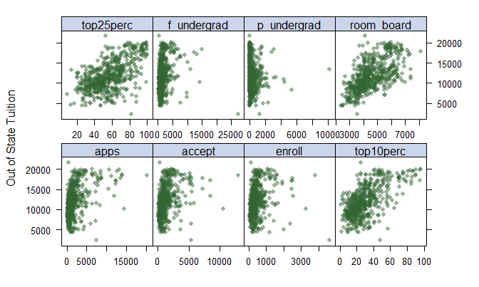
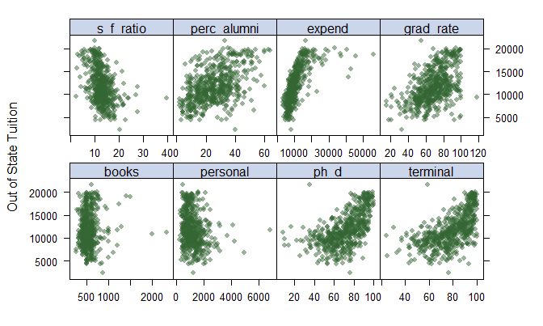
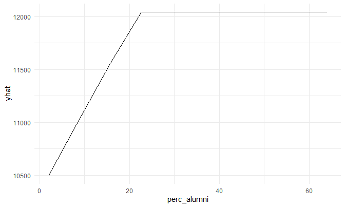

Homework \#1
================
David Nemirovsky
2/28/21

In this exercise, we build nonlinear models using the " data. The
dataset contains statistics for 565 US Colleges from the 1995 issue of
US News and World Report. The response variable is the out-of-state
tuition (Outstate). The predictors are:

  - Apps: Number of applications received

  - Accept: Number of applications accepted

  - Enroll: Number of new students enrolled

  - Top10perc: Pct. new students from top 10% of H.S. class

  - Top25perc: Pct. new students from top 25% of H.S. class

  - F.Undergrad: Number of fulltime undergraduates

  - P.Undergrad: Number of parttime undergraduates

  - Room.Board: Room and board costs

  - Books: Estimated book costs

  - Personal: Estimated personal spending

  - PhD: Pct. of faculty with Ph.D.’s

  - Terminal: Pct. of faculty with terminal degree

  - S.F.Ratio: Student/faculty ratio

  - perc.alumni: Pct. alumni who donate

  - Expend: Instructional expenditure per student

  - Grad.Rate: Graduation rate

## a) **EDA**

  - Read in data and create scatter plots of response (out-of-state
    tuition) vs predictor for each predictor stated above:

<!-- end list -->

``` r
college_df = 
  read_csv("College.csv") %>% 
  janitor::clean_names() %>% 
  drop_na()

x = model.matrix(outstate ~ . -college, college_df)[ ,-1]
y = college_df$outstate

theme1 = trellis.par.get()
theme1$plot.symbol$col = rgb(.2, .4, .2, .5)
theme1$plot.symbol$pch = 16
theme1$plot.line$col = rgb(.8, .1, .1, 1)
theme1$plot.line$lwd = 2
theme1$strip.background$col = rgb(.0, .2, .6, .2)
trellis.par.set(theme1)
featurePlot(x, y, plot = "scatter", labels = c("", "Out of State Tuition"), type = c("p"), layout = c(4, 2))
```



  - According to the above plots, percentage of new students from top
    25% of H.S. class, percentage of new students from top 10% of H.S.
    class, room and board costs, student/faculty ratio, percentage of
    alumni who donate, instructional expenditure per student, graduation
    rate, percentage of faculty with Ph.D.’s, and percentage of faculty
    with terminal degrees seem to be the variables that are moderately-
    to highly-correlated with out-of-state tuition. All of the
    aforementioned variables showed a positive correlation with the
    exception of student/faculty ratio.

## **b) Predicting Out-of-State Tuition Using Smoothing Spline Model of Percentage of Faculty with a Terminal Degree**

  - First, plot smoothing spline models with varying degrees of freedom
    (1-6):

<!-- end list -->

``` r
term_grid = seq(range(college_df$terminal)[1], range(college_df$terminal)[2])

ss_df = 
  tibble(deg_free = 1:6) %>% 
  mutate(
    ss_mod = map(.x = deg_free, ~smooth.spline(college_df$terminal, college_df$outstate, df = .x)), 
    pred = map(.x = ss_mod, ~predict(.x, x = term_grid))) %>% 
  select(deg_free, pred) %>% 
  unnest(pred) %>% 
  unnest() %>% 
  filter(pred > 100) %>% 
  mutate(
    term = c(rep(term_grid, 6)), 
    deg_free = as.factor(deg_free)
  )
```

    ## Warning: Problem with `mutate()` input `ss_mod`.
    ## i not using invalid df; must have 1 < df <= n := #{unique x} = 65
    ## i Input `ss_mod` is `map(...)`.

    ## Warning in smooth.spline(college_df$terminal, college_df$outstate, df = .x): not
    ## using invalid df; must have 1 < df <= n := #{unique x} = 65

    ## Warning: `cols` is now required when using unnest().
    ## Please use `cols = c(pred)`

``` r
college_df %>% 
  ggplot(aes(x = terminal, y = outstate)) + 
  geom_point(alpha = .5) + 
  geom_line(aes(x = term, y = pred, color = deg_free), data = ss_df) + 
  labs(title = "Out-of-State Tuition vs % Faculty with Terminal Degree Smoothing Spline Model by Degrees of Freedom", 
       x = "Faculty with a Terminal Degree (%)", 
       y = "Out-of-State Tuition ($)")
```


  - Using an arbitrary range of degrees of freedom from 1 to 6, it can
    be seen that an adequate number of degrees of freedom would lie
    between 4 and 5, as the lower values (1-3) don’t fit the data well
    and having 6 degrees of freedom results in a model that is not as
    smooth.

  - Next, use generalized cross-validation (GCV) to select degrees of
    freedom:

<!-- end list -->

``` r
ss_gcv = smooth.spline(college_df$terminal, college_df$outstate)

gcv_df = 
  tibble(pred = map(.x = term_grid, ~predict(ss_gcv, .x))) %>% 
  unnest(pred) %>% 
  unnest() %>% 
  filter(pred > 100) %>% 
  mutate(term = term_grid)
```

    ## Warning: `cols` is now required when using unnest().
    ## Please use `cols = c(pred)`

``` r
college_df %>% 
  ggplot(aes(x = terminal, y = outstate)) + 
  geom_point(alpha = .5) + 
  geom_line(aes(x = term, y = pred), data = gcv_df) + 
  labs(title = "Out-of-State Tuition vs % Faculty with Terminal Degree Smoothing Spline Model Using GCV", 
       x = "Faculty with a Terminal Degree (%)", 
       y = "Out-of-State Tuition ($)")
```


  - The chosen number of degrees of freedom using GCV is **4.47**. This
    results in the smoothest model for predicting out-of-stat tuition
    using percentage of faculty with a terminal degree.

## c) \*\* Fitting a Generalized Additive Model (GAM) Using All Predictors\*\*

  - Generate GAM models using all predictors:

<!-- end list -->

``` r
gam_all = gam(outstate ~ apps + accept + enroll + top10perc + top25perc + f_undergrad + p_undergrad + room_board + books + personal + ph_d + terminal + s_f_ratio + perc_alumni + expend + grad_rate, data = college_df)

gam_int = gam(outstate ~ apps + accept + enroll + te(top10perc, top25perc) + f_undergrad + p_undergrad + room_board + books + personal + ph_d + terminal + s_f_ratio + perc_alumni + expend + grad_rate, data = college_df)

gam_smooth = gam(outstate ~ apps + accept + enroll + top10perc + top25perc + f_undergrad + p_undergrad + room_board + books + personal + s(ph_d) + s(terminal) + s_f_ratio + perc_alumni + expend + grad_rate, data = college_df)

gam_fin = gam_inter = gam(outstate ~ apps + accept + enroll + te(top10perc, top25perc) + f_undergrad + p_undergrad + room_board + books + personal + s(ph_d) + s(terminal) + s_f_ratio + perc_alumni + expend + grad_rate, data = college_df)

anova(gam_all, gam_int, gam_smooth, gam_fin, test = "F")
```

    ## Analysis of Deviance Table
    ## 
    ## Model 1: outstate ~ apps + accept + enroll + top10perc + top25perc + f_undergrad + 
    ##     p_undergrad + room_board + books + personal + ph_d + terminal + 
    ##     s_f_ratio + perc_alumni + expend + grad_rate
    ## Model 2: outstate ~ apps + accept + enroll + te(top10perc, top25perc) + 
    ##     f_undergrad + p_undergrad + room_board + books + personal + 
    ##     ph_d + terminal + s_f_ratio + perc_alumni + expend + grad_rate
    ## Model 3: outstate ~ apps + accept + enroll + top10perc + top25perc + f_undergrad + 
    ##     p_undergrad + room_board + books + personal + s(ph_d) + s(terminal) + 
    ##     s_f_ratio + perc_alumni + expend + grad_rate
    ## Model 4: outstate ~ apps + accept + enroll + te(top10perc, top25perc) + 
    ##     f_undergrad + p_undergrad + room_board + books + personal + 
    ##     s(ph_d) + s(terminal) + s_f_ratio + perc_alumni + expend + 
    ##     grad_rate
    ##   Resid. Df Resid. Dev     Df Deviance      F   Pr(>F)   
    ## 1    547.00 2092185295                                   
    ## 2    541.70 2027933177 5.2983 64252118 3.3811 0.004270 **
    ## 3    537.08 1975095132 4.6168 52838045 3.1909 0.009337 **
    ## 4    532.04 1919385157 5.0410 55709975 3.0812 0.009226 **
    ## ---
    ## Signif. codes:  0 '***' 0.001 '**' 0.01 '*' 0.05 '.' 0.1 ' ' 1

  - According to the above F-test of the four hypothesized models, the
    model that accounted for the interaction between percentage of new
    students from top 10% of H.S. class and percentage of new students
    from top 25% of H.S. class, and the nonparametric variables of
    percentage of faculty with Ph.D.’s and percentage of faculty with
    terminal degrees fit the best GAM. Smoothing splines were used to
    account for the latter two variables.

  - Now, plot the GAM:

<!-- end list -->

``` r
vis.gam(gam_fin, view = c("top10perc", 'top25perc'), color = "topo")
```


  - Summary of model:

<!-- end list -->

``` r
summary(gam_fin)
```

    ## 
    ## Family: gaussian 
    ## Link function: identity 
    ## 
    ## Formula:
    ## outstate ~ apps + accept + enroll + te(top10perc, top25perc) + 
    ##     f_undergrad + p_undergrad + room_board + books + personal + 
    ##     s(ph_d) + s(terminal) + s_f_ratio + perc_alumni + expend + 
    ##     grad_rate
    ## 
    ## Parametric coefficients:
    ##               Estimate Std. Error t value Pr(>|t|)    
    ## (Intercept)  4.520e+03  8.319e+02   5.433 8.42e-08 ***
    ## apps         7.879e-02  1.200e-01   0.657 0.511576    
    ## accept       1.046e+00  2.170e-01   4.819 1.88e-06 ***
    ## enroll      -3.264e+00  8.451e-01  -3.862 0.000126 ***
    ## f_undergrad  2.524e-03  1.320e-01   0.019 0.984750    
    ## p_undergrad -2.069e-01  1.349e-01  -1.534 0.125550    
    ## room_board   8.986e-01  9.746e-02   9.221  < 2e-16 ***
    ## books        9.742e-02  5.107e-01   0.191 0.848785    
    ## personal    -4.759e-01  1.362e-01  -3.494 0.000515 ***
    ## s_f_ratio   -2.566e+01  2.843e+01  -0.902 0.367205    
    ## perc_alumni  4.493e+01  8.353e+00   5.379 1.12e-07 ***
    ## expend       1.537e-01  2.529e-02   6.078 2.31e-09 ***
    ## grad_rate    1.878e+01  6.127e+00   3.064 0.002290 ** 
    ## ---
    ## Signif. codes:  0 '***' 0.001 '**' 0.01 '*' 0.05 '.' 0.1 ' ' 1
    ## 
    ## Approximate significance of smooth terms:
    ##                           edf Ref.df     F  p-value    
    ## te(top10perc,top25perc) 6.567  7.520 3.518 0.000825 ***
    ## s(ph_d)                 4.544  5.612 1.870 0.075698 .  
    ## s(terminal)             4.745  5.824 1.872 0.079249 .  
    ## ---
    ## Signif. codes:  0 '***' 0.001 '**' 0.01 '*' 0.05 '.' 0.1 ' ' 1
    ## 
    ## R-sq.(adj) =  0.738   Deviance explained = 75.1%
    ## GCV = 3.7801e+06  Scale est. = 3.5867e+06  n = 564

  - **According to the final GAM at the 10% significance level, number
    of applications accepted, number of applications enrolled, room and
    board costs, estimated personal spending, percentage of alumni who
    donate, instructional expenditure per student, graduation rate,
    percentage of new students from top 25% of H.S. class, percentage of
    new students from top 10% of H.S. class, and the smoothing splines
    of percentage of faculty with Ph.D.’s and percentage of faculty with
    terminal degrees were all found to be significant predictors of
    out-of-state tuition.**

## **d) Fit a Multivariate Adaptive Regression Spline (MARS) Model Using All Predictors**

  - First, fit MARS models to determine best one:

<!-- end list -->

``` r
mars_grid = expand.grid(degree = 1:3, 
                         nprune = 2:18)
ctrl = trainControl(method = "cv", number = 10)
set.seed(37564)

mars_fit <- train(x, y,
                  method = "earth",
                  tuneGrid = mars_grid,
                  trControl = ctrl)

ggplot(mars_fit)
```


``` r
mars_fit$bestTune
```

    ##    nprune degree
    ## 12     13      1

``` r
coef(mars_fit$finalModel)
```

    ##         (Intercept)     h(expend-15365)  h(4450-room_board)     h(grad_rate-97) 
    ##       11099.4030981          -0.7308623          -1.2860756        -205.1619640 
    ##     h(97-grad_rate) h(f_undergrad-1355) h(1355-f_undergrad)   h(22-perc_alumni) 
    ##         -24.3424023          -0.3435602          -1.3670697         -77.4621692 
    ##        h(apps-3712)    h(1300-personal)       h(913-enroll)      h(2193-accept) 
    ##           0.4247957           0.9815494           4.6968931          -2.0136737 
    ##      h(expend-6881) 
    ##           0.7344018

  - According to the above RMSE plot with varying degrees and number of
    terms, it appears as though the MARS model with **13** retained
    terms using **1** degree of interactions generated the lowest RMSE,
    indicating that these tuning parameters fit the best model, using
    all of the variable to predict out-of-state tuition.

  - Now, let’s examine the partial dependence plot using the percentage
    of alumni who donate as an arbitrary predictor:

<!-- end list -->

``` r
pdp::partial(mars_fit, pred.var = c("perc_alumni"), grid.resolution = 10) %>% autoplot()
```

    ## Warning: Use of `object[[1L]]` is discouraged. Use `.data[[1L]]` instead.

    ## Warning: Use of `object[["yhat"]]` is discouraged. Use `.data[["yhat"]]`
    ## instead.



  - The above partial dependence plot of percentage of alumni who donate
    as a predictor for out-of-state tuition shows that percentage of
    alumni who donate does not have as strong of an effect on
    out-of-state tuition after the threshold of \~22%.
